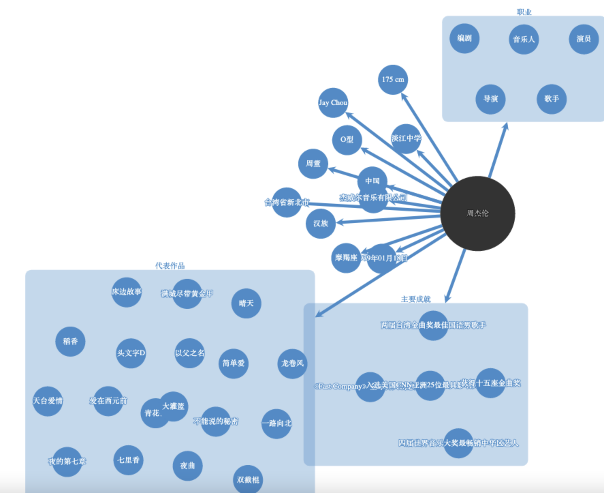
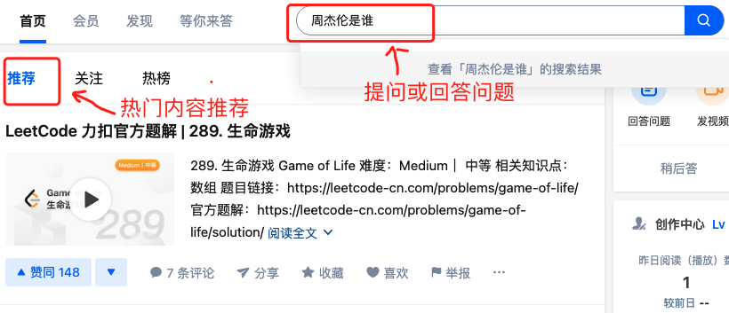

# 基于知识图谱的问答网站

在这个选题中，你需要实现一个基于知识图谱的问答网站。

这个选题具有以下特点：

* 时下知识图谱领域最热门的落地应用之一
* 学会实现一个有趣的人工智能应用
* 在实现完基本功能后，进阶部分可以自由发挥，你可以根据你的兴趣，选择提升系统的问答能力；又或者是让你的服务成为一个高可用的服务；又或是根据用户的问题找到一种办法自动更新补全图谱etc..

## 1. 背景知识与系统基本功能
知识图谱问答系统主要有两种，一种是领域知识图谱问答，另一种是开放域知识图谱问答。
领域知识图谱问答更专注于回答特定领域的问题，例如对于金融领域问答，我们只需要回答金融领域相关知识即可，如：“请问基金是什么？”
开放域知识图谱问答则更为全面，可回答的问题的范围包含了各个领域，例如询问：”七里香是谁唱的？“
界面设计你可以自由发挥，实现任意一种问答系统即可。

## 2.基本功能

* 登录、注册
* 基于知识图谱的问答

    如：Q:”七里香是谁唱的？“ A：“周杰伦”
    
    （可选）根据问题给出图谱中相关内容的可视化展示，如现在有一个问题：”周杰伦的职业是？“，给出类似下图所示。

* 用户与系统的交互历史记录
* 图谱知识互动

    对于缺失或错误的图谱内容，允许用户提交增删改请求。
* 热门问题推荐

    如：大家都在问XXXXX
* 面向平台所有用户的问答

    类似知乎、Quora、百度知道

* 鼓励大家创新，可以在基本功能基础上选择你感兴趣的进阶任务完成，也可以自由发挥。

## 3. 技术实现

### 3.1 工程建议
* 采用前后端分离架构
* 对技术不做硬性要求，前端推荐使用Angular（也可以使用Vue、React等）。后端可使用Spring全家桶/Hadoop全家桶等
* （选做）ios/安卓移动端可使用Flutter等。

### 3.2 知识图谱储存建议
* 图谱数据可以从网上爬取，也可以使用网络上公开的知识图谱dump文件，详见参考资料
* 图谱储存可以储存成简单的spo三元组形式（此方法建议使用mongodb），也可以储存成复杂图（此方法建议使用Neo4j）

### 3.3 知识图谱问答模块建议
* 知识图谱问答模块通常分为两部分，第一部分是识别问句中的实体，第二部分是谓词匹配。例如问句“七里香是谁唱的？”，问答系统第一步需要识别实体“七里香”，第二步需要匹配谓词“歌手”（首先你需要获取），最终确定答案是“周杰伦”。
* 实体识别方法推荐：1）基于字典树+编辑距离的方法，代码详见 https://github.com/sorahjy/chinese_fuzzy_matching 2）深度学习方法NER 
* 谓词匹配方法推荐：1）LCS或者基于字典树+编辑距离的方法 2）深度学习方法参考BERT-NSP（对”问句[SEP]谓词“做二分类）

（对于实体识别和谓词匹配，使用方法1和方法2不影响实际评分，按照你的兴趣选择即可，方法1已给出示例代码，方法2详见参考资料）

### 3.4 参考资料
* 中文开源知识图谱 http://www.openkg.cn/dataset?tags=%E7%9F%A5%E8%AF%86%E5%9B%BE%E8%B0%B1
* NER https://github.com/ProHiryu/bert-chinese-ner
* BERT https://github.com/google-research/bert
* 基于BERT的KBQA https://github.com/WenRichard/KBQA-BERT
* HuggingFace https://huggingface.co/

## 4. 评分细则
### 4.1 分数组成

* 基本功能分：即完成系统基本内容与流程，满分 100 分。

* 进阶任务分：推荐选做助教列举的功能，能力较强的同学可自定义增加附加功能，最多 15 分。

* 个人工作分：根据小组分工及个人完成工作量得分。每组组员该项分数总和 30 分，根据贡献比例分摊。

* 个人最终得分 = 基本功能分 + 进阶任务分 + 个人工作分，值域为 [0, 145]。

### 4.2 评分点 
 | 功能项 | 得分项 | 最高分数 |
 | :--- | :--- | :--- |
 | 基本流程 | 完整的后端 | 10 |
 | （20分） | 美观且友好的前端界面 | 10 |
 | 功能实现 | 登录与注册 | 5 |
 | （50分） | 热门问题推荐 | 5 |
  | | 面向平台所有用户的问答 | 20 |
 | | 用户与系统的交互历史记录 | 5 |
 | | 图谱存储与互动 | 5 |
 | | 简单的知识图谱问答 | 10 |
 | 工程能力 | 文档| 5 |
 | （20分） | 系统架构 | 10 |
 |  | 代码风格 | 5 |
 | 项目部署 | 使用容器化部署 | 5 | 
 | （10分） | 将服务部署到公有云 | 5 |
 | 进阶任务 | 移动端支持 | 15 |
 | （上限15分） | 支持某一类复杂问答 | 每一类5分 |
 |  | 知识图谱的自动更新 | 10 |
 |  | 其他合理的附加功能 | 5-10 | 

复杂问答包括但不限于：
* 上下文继承多轮问答示例： Q1：”七里香的作词是谁？“ A1：”方文山“ Q2：”那它是谁唱的“ A2：”周杰伦“ Q3：”他还唱过哪些歌“ A3：“稻香、等你下课...” （注意需要继承的内容可能为上一问的实体/谓词/答案）

* 多跳问答： Q：“复旦大学的校长是哪里人？” A：“广东” （复旦大学-校长-出生地-广东）

* 比较类问题： Q：“上海和浙江哪个大？” A：“浙江” （在获取实体上海和浙江后，找到谓词地理面积，随后比较得出答案）

* 是否类问题： Q：“杭州在浙江吗” A：“是” 
* 服务的高可用： 如何应对海量级别的api调用？如何实现容灾切换？如何应对服务可能受到的潜在攻击？请展开你的想象。

### 评分点说明
1. 每⼀项的分数取决于该项功能的完成度。完成度和可⽤性越好，分数越⾼。
2. 项目完整度和易用性评价标准:
    * A. 最低要求为必须实现并完成规定的用户功能与操作。核⼼功能和技术都有实现，在应⽤逻辑和实际操作便捷性上可以不做考虑。
    * B. 基本要求为实现并完成规定的⽤户功能和操作，并设计合理便捷的操作流程，系统各部分衔接过度⾃然，⽅便使⽤。
    * C. 进阶要求为实现并完成规定的⽤户功能、操作和进阶加分项，形成⼀套完整的可发布的应⽤用逻辑。 A、B、C 分别对应 0 - 3 分，4 - 6 分，7 - 10 分。
3. 附加功能必须在⽂档中明确写出，概述该功能并描述实现原理理。
4. 项⽬设计文档需要⾄少包含:
    * 项⽬组织以及其中每个⽂件的说明。
    * 关键功能实现的细节。
    * 服务器部署配置的详细介绍。
5. 团队分⼯文档需要⾄少包含: 
    * 团队成员、分⼯、具体完成⼯作，列出每个人的贡献比例例。
    * 其他你们想说明的问题。

 ## 提交

1. 提交物包含以下两项：
    * 源代码：推荐使用 Git 进行协作，提交到 GitHub 等 Git 托管平台上。
    * 文档：推荐使用 Markdown 编写项目文档，与源代码一同提交到 Git 托管平台上。
2. 源代码与文档需要压缩打包提交到 FTP 上，文件名中请包含小队所有成员的姓名与学号。
3. 友情提示：请尽早开工，本学期只有一个 Project，临时赶工很有可能完不成。
